# DDGP Single-Pruning Experiments

_Auto-generated by `scripts/ddgp_build_experiments_md.py`. Do not edit manually._

This report groups selected single-pruning DDGP instances by instance id. Each instance includes the solution counts, dependency-set metrics, predecessor sets, adjacency matrices, the dependency DAG, and the base-clique transition graph.

In the base-clique transition graph, each node is a distinct predecessor clique $U_i$ used to place one or more vertices. A directed edge $U_i \to U_j$ means that a vertex placed from $U_i$ is later reused inside $U_j$; dotted edges mark large clique overlap without direct reuse.

## Selected Instances

| Instance | Kind | Pruning edge | Base count | Solutions | Local solutions | Fraction | Union choices | Symdiff choices | Intersection choices |
|---|---|---:|---:|---:|---:|---:|---:|---:|---:|
| [ddgp-last-seed-0019](#ddgp-last-seed-0019) | last-seed | 2-8 | 8 | 2 | 1 | 0.25 | 4 | 4 | 0 |
| [ddgp-last-nonseed-0017](#ddgp-last-nonseed-0017) | last-nonseed | 5-8 | 32 | 4 | 1 | 0.125 | 3 | 3 | 0 |
| [ddgp-last-nonseed-0002](#ddgp-last-nonseed-0002) | last-nonseed | 5-8 | 16 | 8 | 2 | 0.5 | 3 | 3 | 0 |
| [ddgp-nonlast-nonseed-0004](#ddgp-nonlast-nonseed-0004) | nonlast-nonseed | 5-7 | 32 | 2 | 1 | 0.0625 | 4 | 4 | 0 |
| [ddgp-nonlast-nonseed-0013](#ddgp-nonlast-nonseed-0013) | nonlast-nonseed | 3-7 | 2 | 2 | 2 | 1.0 | 3 | 3 | 0 |

## ddgp-last-seed-0019

| Field | Value |
|---|---|
| Kind | `last-seed` |
| Pruning edge | `2-8` |
| Raw count | `32` |
| Base count | `8` |
| Solutions | `2` |
| Removed by pruning | `6` |
| Fraction of base | `0.25` |
| Local raw count | `16` |
| Local base count | `4` |
| Local solutions | `1` |
| Local removed by pruning | `3` |
| Local fraction of base | `0.25` |
| Outside choices | `1` |
| Union choices | `4` |
| Symdiff choices | `4` |
| Intersection choices | `0` |
| $\operatorname{Fix}_U(u)$ | `{2}` |
| $\operatorname{Fix}_U(v)$ | `{1,2,3,5,6,7,8}` |
| $\operatorname{Fix}_U(u) \cup \operatorname{Fix}_U(v)$ | `{1,2,3,5,6,7,8}` |
| $\operatorname{Fix}_U(u) \cap \operatorname{Fix}_U(v)$ | `{2}` |
| $\operatorname{Fix}_U(u) \triangle \operatorname{Fix}_U(v)$ | `{1,3,5,6,7,8}` |

Predecessor sets: $U_{3}=(1, 2)$, $U_{4}=(2, 3)$, $U_{5}=(1, 2)$, $U_{6}=(3, 5)$, $U_{7}=(3, 6)$, $U_{8}=(5, 7)$

<table>
<tr>
<th>Full adjacency matrix</th>
<th>Induced matrix on fixing sets</th>
<th>Dependency DAG by level</th>
<th>Base-clique transition graph</th>
</tr>
<tr>
<td>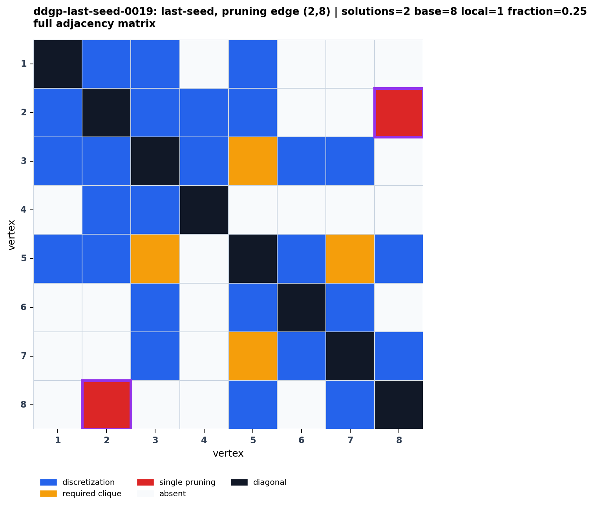</td>
<td>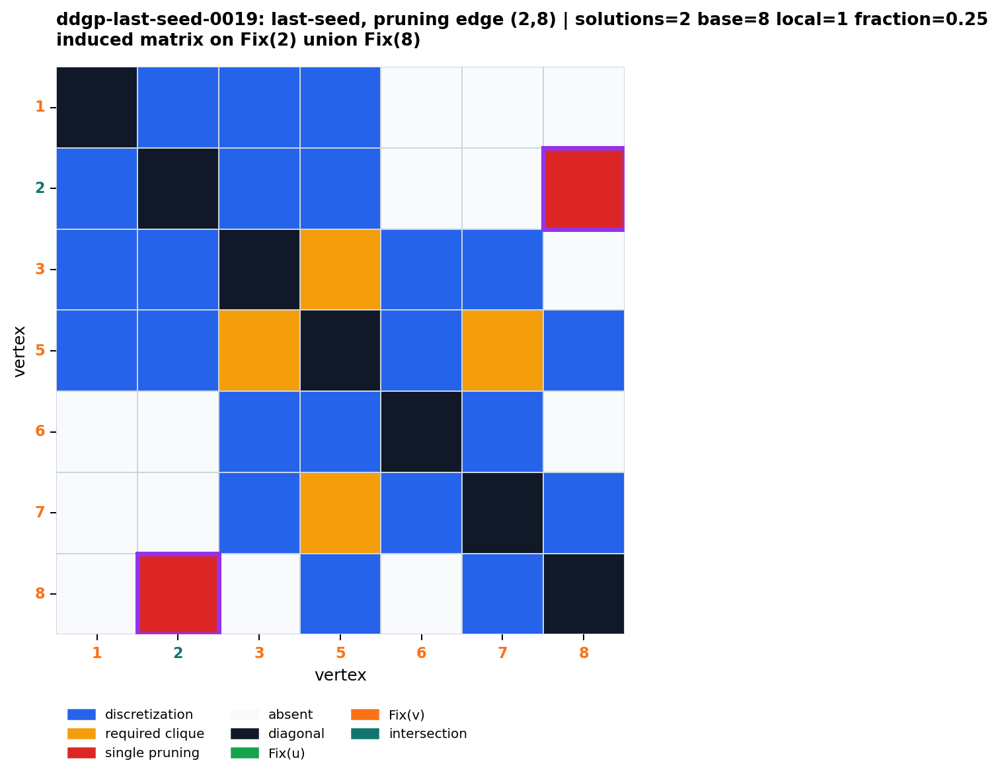</td>
<td>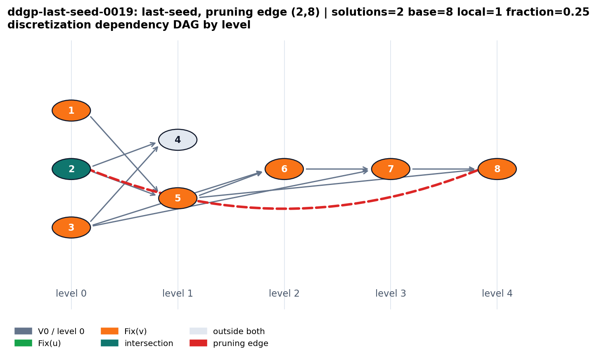</td>
<td>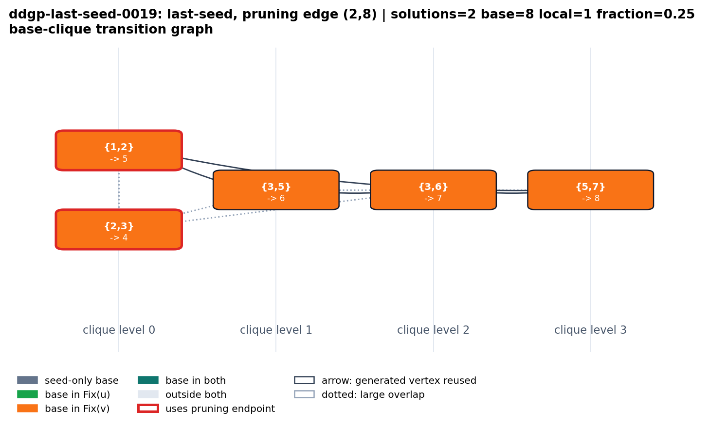</td>
</tr>
</table>

## ddgp-last-nonseed-0017

| Field | Value |
|---|---|
| Kind | `last-nonseed` |
| Pruning edge | `5-8` |
| Raw count | `32` |
| Base count | `32` |
| Solutions | `4` |
| Removed by pruning | `28` |
| Fraction of base | `0.125` |
| Local raw count | `8` |
| Local base count | `8` |
| Local solutions | `1` |
| Local removed by pruning | `7` |
| Local fraction of base | `0.125` |
| Outside choices | `2` |
| Union choices | `3` |
| Symdiff choices | `3` |
| Intersection choices | `0` |
| $\operatorname{Fix}_U(u)$ | `{1,3,5}` |
| $\operatorname{Fix}_U(v)$ | `{2,3,6,8}` |
| $\operatorname{Fix}_U(u) \cup \operatorname{Fix}_U(v)$ | `{1,2,3,5,6,8}` |
| $\operatorname{Fix}_U(u) \cap \operatorname{Fix}_U(v)$ | `{3}` |
| $\operatorname{Fix}_U(u) \triangle \operatorname{Fix}_U(v)$ | `{1,2,5,6,8}` |

Predecessor sets: $U_{3}=(1, 2)$, $U_{4}=(1, 3)$, $U_{5}=(1, 3)$, $U_{6}=(2, 3)$, $U_{7}=(1, 4)$, $U_{8}=(3, 6)$

<table>
<tr>
<th>Full adjacency matrix</th>
<th>Induced matrix on fixing sets</th>
<th>Dependency DAG by level</th>
<th>Base-clique transition graph</th>
</tr>
<tr>
<td>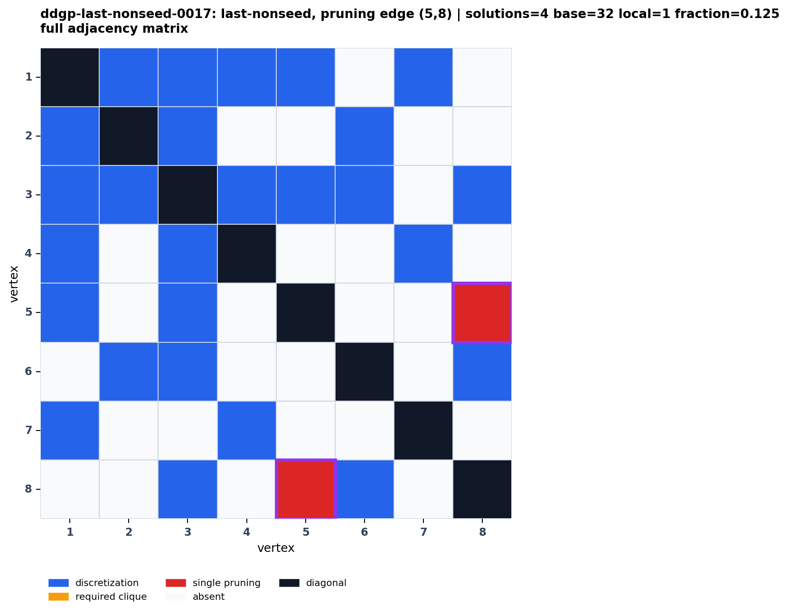</td>
<td>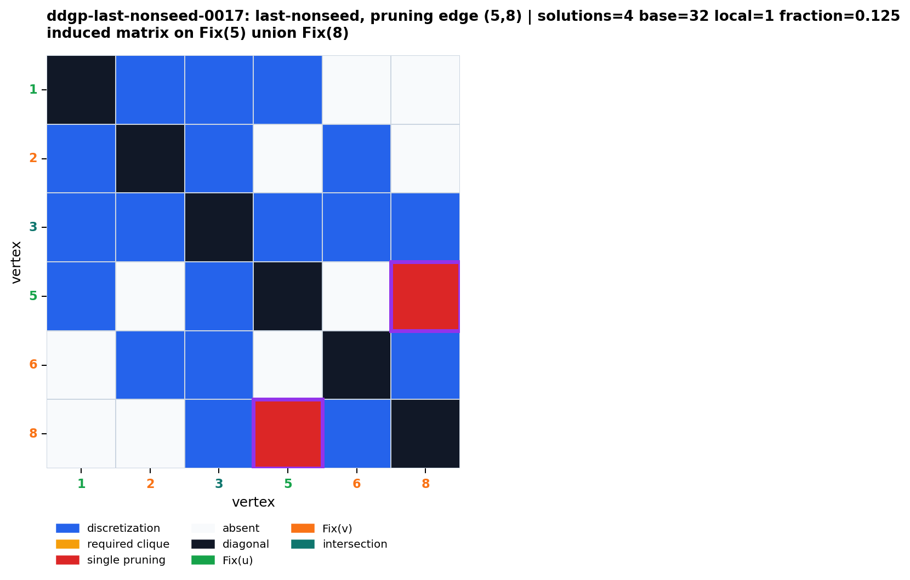</td>
<td>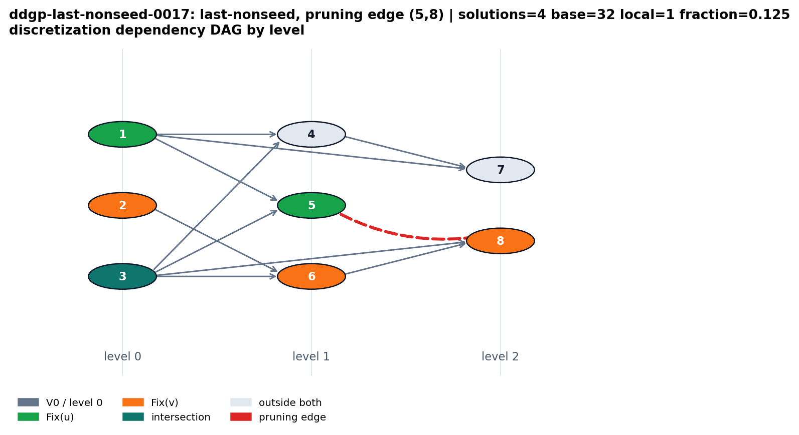</td>
<td>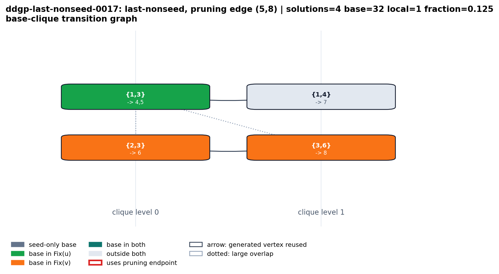</td>
</tr>
</table>

## ddgp-last-nonseed-0002

| Field | Value |
|---|---|
| Kind | `last-nonseed` |
| Pruning edge | `5-8` |
| Raw count | `32` |
| Base count | `16` |
| Solutions | `8` |
| Removed by pruning | `8` |
| Fraction of base | `0.5` |
| Local raw count | `8` |
| Local base count | `4` |
| Local solutions | `2` |
| Local removed by pruning | `2` |
| Local fraction of base | `0.5` |
| Outside choices | `2` |
| Union choices | `3` |
| Symdiff choices | `3` |
| Intersection choices | `0` |
| $\operatorname{Fix}_U(u)$ | `{2,3,4,5}` |
| $\operatorname{Fix}_U(v)$ | `{2,3,8}` |
| $\operatorname{Fix}_U(u) \cup \operatorname{Fix}_U(v)$ | `{2,3,4,5,8}` |
| $\operatorname{Fix}_U(u) \cap \operatorname{Fix}_U(v)$ | `{2,3}` |
| $\operatorname{Fix}_U(u) \triangle \operatorname{Fix}_U(v)$ | `{4,5,8}` |

Predecessor sets: $U_{3}=(1, 2)$, $U_{4}=(2, 3)$, $U_{5}=(2, 4)$, $U_{6}=(4, 5)$, $U_{7}=(3, 5)$, $U_{8}=(2, 3)$

<table>
<tr>
<th>Full adjacency matrix</th>
<th>Induced matrix on fixing sets</th>
<th>Dependency DAG by level</th>
<th>Base-clique transition graph</th>
</tr>
<tr>
<td>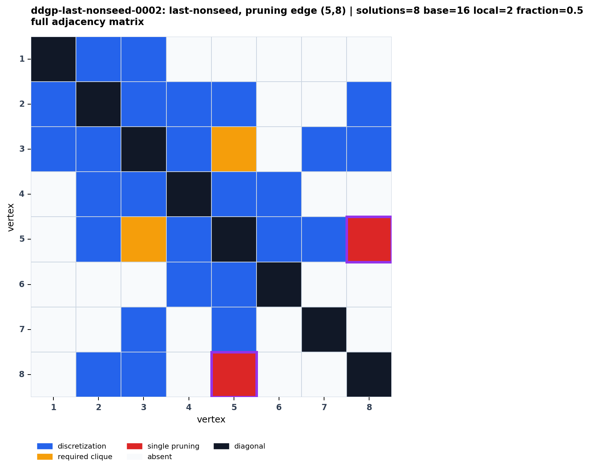</td>
<td>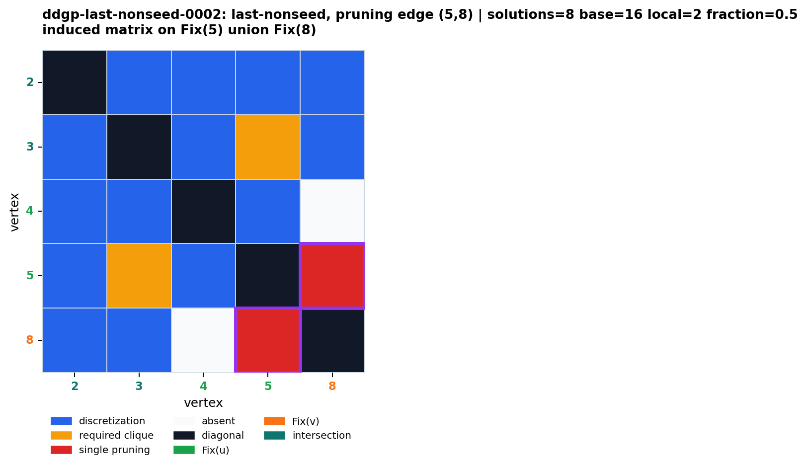</td>
<td>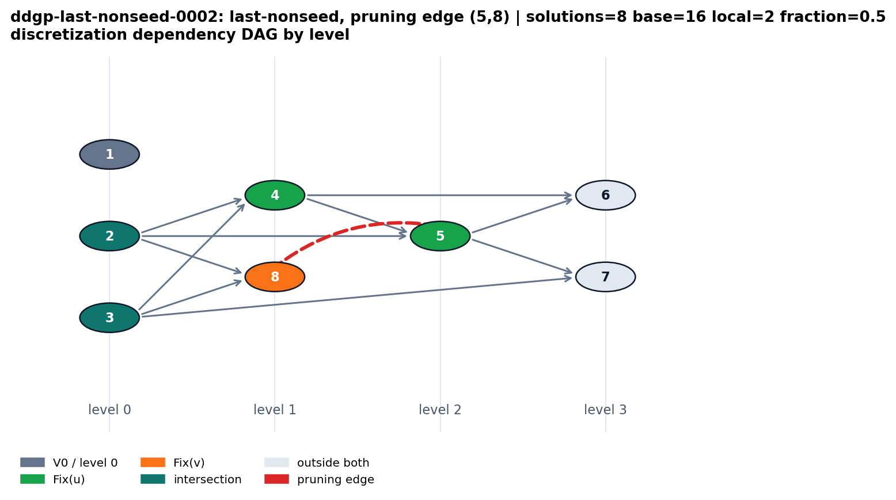</td>
<td>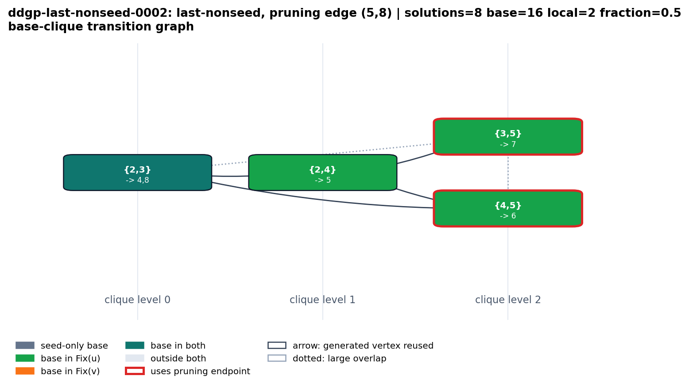</td>
</tr>
</table>

## ddgp-nonlast-nonseed-0004

| Field | Value |
|---|---|
| Kind | `nonlast-nonseed` |
| Pruning edge | `5-7` |
| Raw count | `32` |
| Base count | `32` |
| Solutions | `2` |
| Removed by pruning | `30` |
| Fraction of base | `0.0625` |
| Local raw count | `16` |
| Local base count | `16` |
| Local solutions | `1` |
| Local removed by pruning | `15` |
| Local fraction of base | `0.0625` |
| Outside choices | `1` |
| Union choices | `4` |
| Symdiff choices | `4` |
| Intersection choices | `0` |
| $\operatorname{Fix}_U(u)$ | `{1,3,4,5}` |
| $\operatorname{Fix}_U(v)$ | `{2,3,6,7}` |
| $\operatorname{Fix}_U(u) \cup \operatorname{Fix}_U(v)$ | `{1,2,3,4,5,6,7}` |
| $\operatorname{Fix}_U(u) \cap \operatorname{Fix}_U(v)$ | `{3}` |
| $\operatorname{Fix}_U(u) \triangle \operatorname{Fix}_U(v)$ | `{1,2,4,5,6,7}` |

Predecessor sets: $U_{3}=(1, 2)$, $U_{4}=(1, 3)$, $U_{5}=(3, 4)$, $U_{6}=(2, 3)$, $U_{7}=(3, 6)$, $U_{8}=(2, 6)$

<table>
<tr>
<th>Full adjacency matrix</th>
<th>Induced matrix on fixing sets</th>
<th>Dependency DAG by level</th>
<th>Base-clique transition graph</th>
</tr>
<tr>
<td>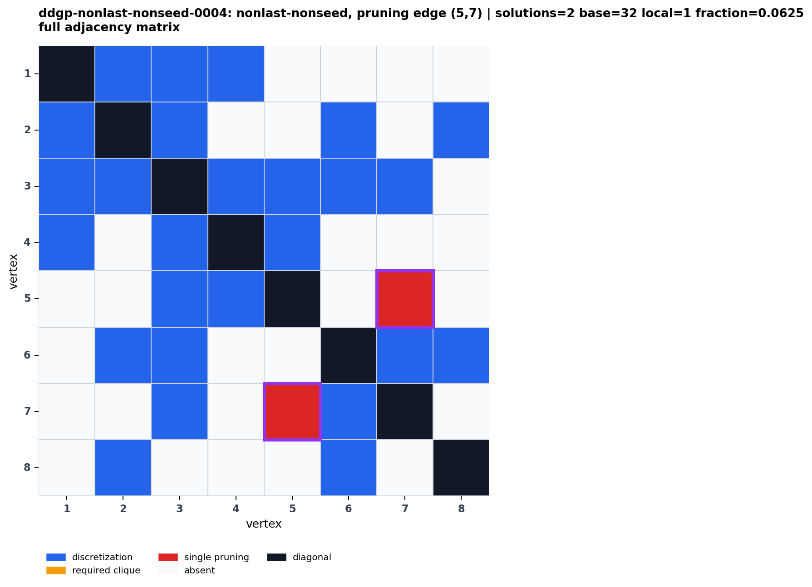</td>
<td>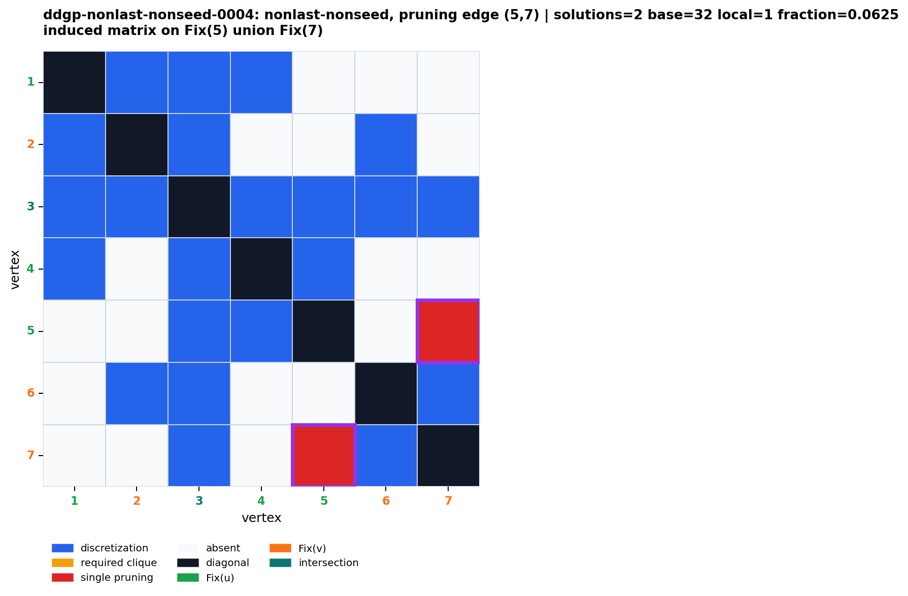</td>
<td>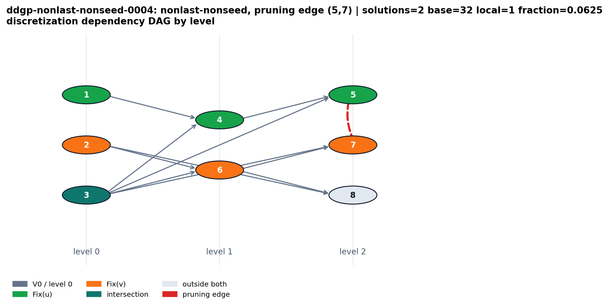</td>
<td>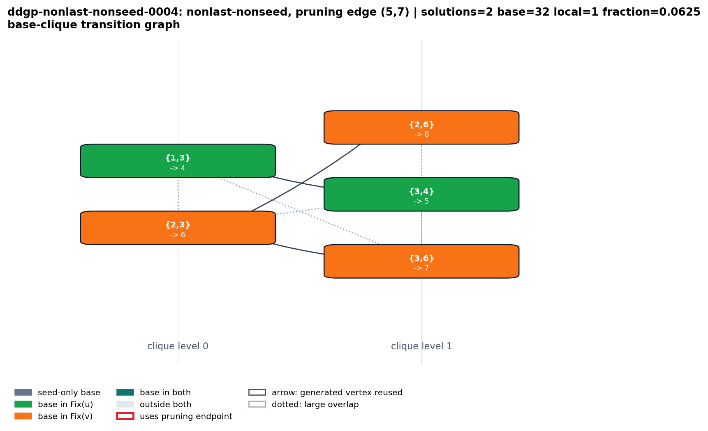</td>
</tr>
</table>

## ddgp-nonlast-nonseed-0013

| Field | Value |
|---|---|
| Kind | `nonlast-nonseed` |
| Pruning edge | `3-7` |
| Raw count | `32` |
| Base count | `2` |
| Solutions | `2` |
| Removed by pruning | `0` |
| Fraction of base | `1.0` |
| Local raw count | `8` |
| Local base count | `4` |
| Local solutions | `2` |
| Local removed by pruning | `2` |
| Local fraction of base | `0.5` |
| Outside choices | `2` |
| Union choices | `3` |
| Symdiff choices | `3` |
| Intersection choices | `0` |
| $\operatorname{Fix}_U(u)$ | `{3}` |
| $\operatorname{Fix}_U(v)$ | `{1,2,3,4,6,7}` |
| $\operatorname{Fix}_U(u) \cup \operatorname{Fix}_U(v)$ | `{1,2,3,4,6,7}` |
| $\operatorname{Fix}_U(u) \cap \operatorname{Fix}_U(v)$ | `{3}` |
| $\operatorname{Fix}_U(u) \triangle \operatorname{Fix}_U(v)$ | `{1,2,4,6,7}` |

Predecessor sets: $U_{3}=(1, 2)$, $U_{4}=(1, 2)$, $U_{5}=(1, 2)$, $U_{6}=(3, 4)$, $U_{7}=(4, 6)$, $U_{8}=(5, 7)$

<table>
<tr>
<th>Full adjacency matrix</th>
<th>Induced matrix on fixing sets</th>
<th>Dependency DAG by level</th>
<th>Base-clique transition graph</th>
</tr>
<tr>
<td>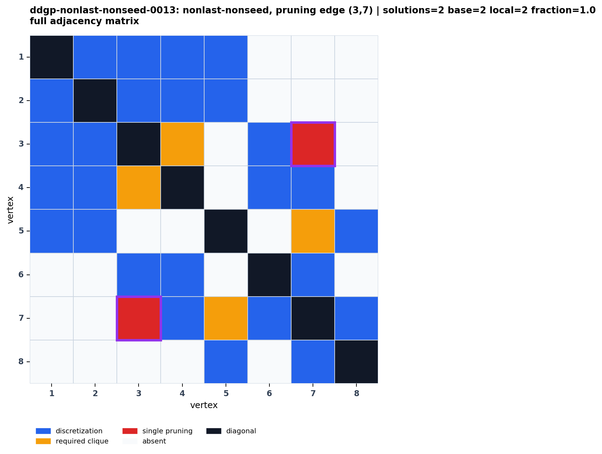</td>
<td>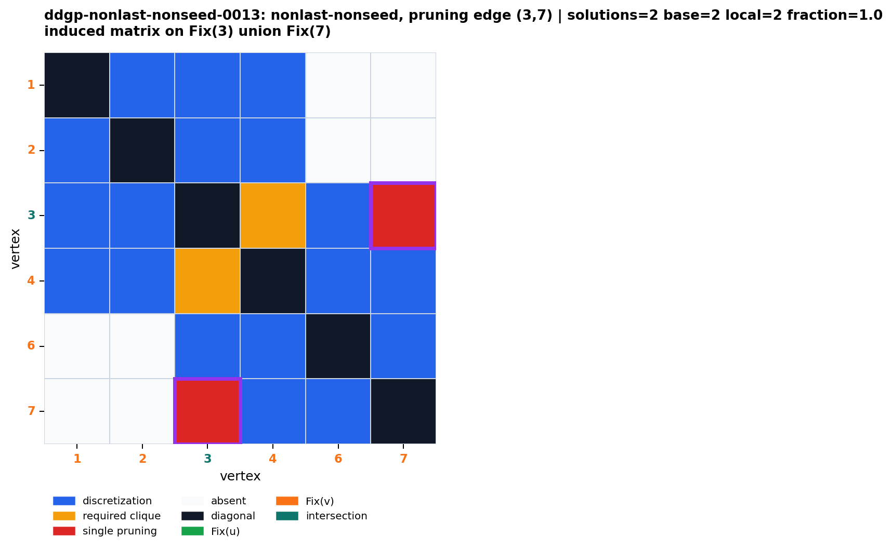</td>
<td>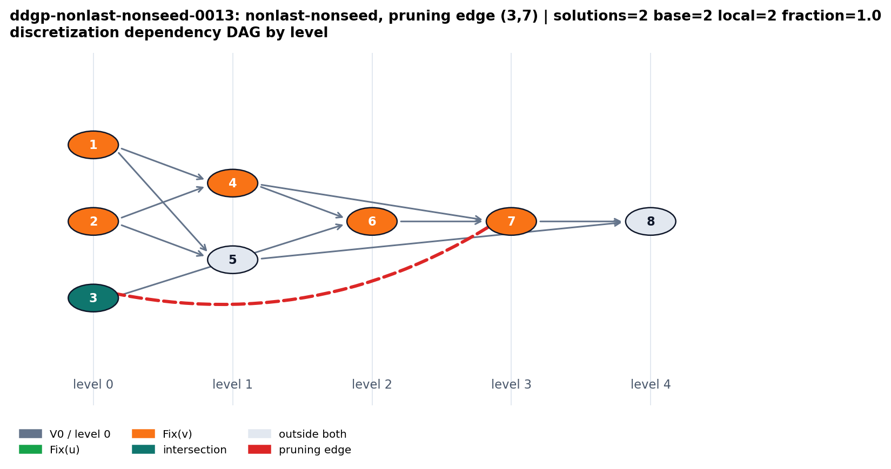</td>
<td>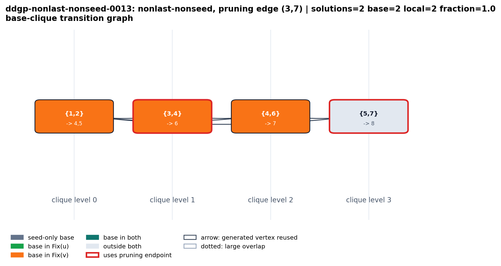</td>
</tr>
</table>
